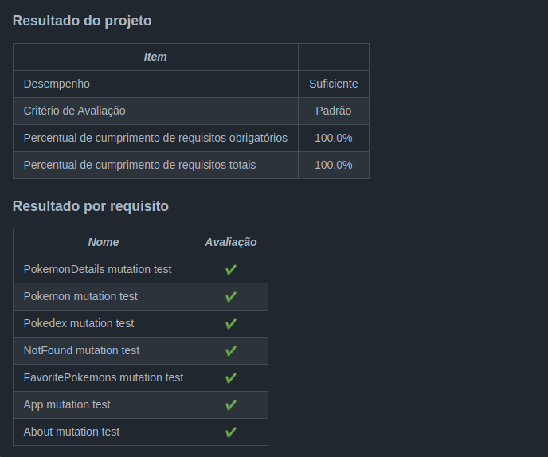

<h1>Sobre</h1>

Quinto projeto do módulo 2 - Front-end, da <a href="https://betrybe.com" target="_blank">Trybe!</a>

Dessa vez foi o projeto React Testing Library. Tivemos que escrever testes automatizados em uma aplicação React.

Utilizamos a biblioteca RTL - React Testing Library em conjunto com a JEST.

obs: Toda a aplicação foi fornecida pela trybe. Eu fiz apenas os testes.

<h1>Instalando</h1>

Para instalar, basta executar o comando <code>npm install</code> no diretório raiz do projeto.

Logo depois execute o comando <code>npm start</code>

<h1>Tecnologias utilizadas</h1>

<ul>
  <li>RTL - React Testing Library</li>
  <li>JEST</li>
</ul>

<h1>Nota</h1>
